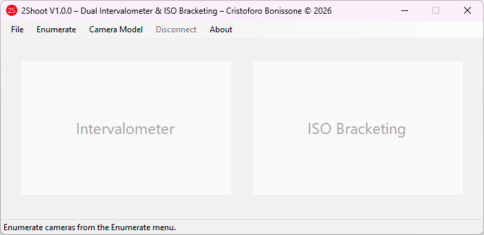
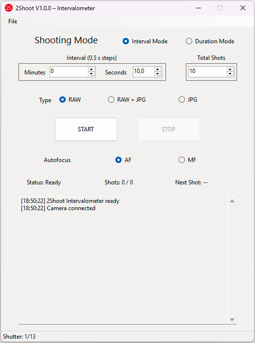
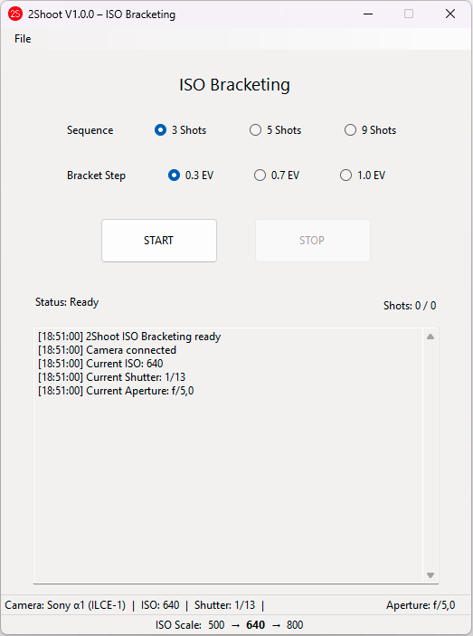
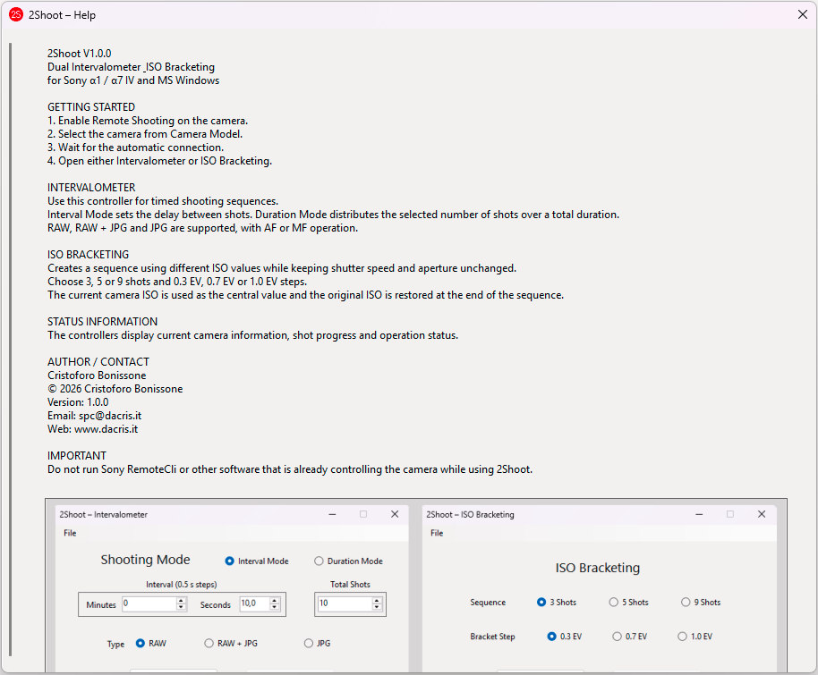

# 2Shoot Dual Intervalometer & ISO Bracketing

**2Shoot Dual Intervalometer & ISO Bracketing** is a portable Windows application for supported Sony Alpha cameras.  
It provides wireless interval shooting and true ISO bracketing over Wi-Fi with a simple desktop interface.

**Current version:** 1.0.0  
**License:** Proprietary Freeware  
**Author:** Cristoforo Bonissone

## Supported Cameras

- Sony Alpha 1 (ILCE-1)
- Sony Alpha 7 IV (ILCE-7M4)

## Main Features

### Intervalometer

- Interval Mode
- Duration Mode
- 0.5 second time steps
- AF and MF operation
- RAW, RAW+JPG and JPG workflows
- Real shutter-speed monitoring for timing checks
- User-selected destination folder
- Automatic opening of the destination folder after a successful sequence

### ISO Bracketing

- True ISO bracketing
- 3, 5 or 9 shots
- 0.3 EV, 0.7 EV or 1.0 EV steps
- Current camera ISO used as the center value
- Ascending ISO sequence
- Minimum bracket ISO: 100
- Live ISO, shutter-speed and aperture information
- Automatic restoration of the original ISO after a completed sequence
- Destination folder opened after a successful sequence

Example with base ISO 1600, 9 shots and 1 EV:

`100 -> 200 -> 400 -> 800 -> 1600 -> 3200 -> 6400 -> 12800 -> 25600`

## Screenshots

### Main Window

### Intervalometer

### ISO Bracketing

### Help

## System Requirements

- Microsoft Windows 10 or Windows 11, 64-bit
- Supported Sony camera
- Wi-Fi network connection
- Sony camera configured for Remote Shooting

The application is distributed as a portable Windows package and does not require a traditional installer.

## Camera Setup

Before starting 2Shoot:

1. Enable Remote Shooting on the camera.
2. Make sure the camera and computer can communicate over Wi-Fi.
3. Close Sony RemoteCli or any other application already controlling the camera.
4. Start 2Shoot.
5. Use **Enumerate** to discover supported cameras.
6. Select the camera from **Camera Model**.

2Shoot can perform up to three connection attempts before reporting a connection failure.

## Download

Official project page:

https://www.dacris.it/2shoot/

Direct download:

https://www.dacris.it/2shoot/downloads/2Shoot_Dual_Intervalometer_ISO_Bracketing.zip

## Documentation

User guide:

https://www.dacris.it/2shoot/downloads/2Shoot_USER_GUIDE.txt

PAD file:

https://www.dacris.it/2shoot/2shoot_pad.xml

## License

2Shoot Dual Intervalometer & ISO Bracketing is **proprietary freeware**.

The original, unmodified package may be redistributed free of charge provided that the original files and license information remain intact.

Modification, sale, commercial repackaging, or distribution of modified versions requires prior permission from the author, subject to applicable law.

This repository is intended for project information, documentation, screenshots and release references.  
**The application source code is not distributed as open source.**

## Sony Notice

Sony, Alpha 1, Alpha 7 IV and related names and trademarks are the property of their respective owners.

2Shoot Dual Intervalometer & ISO Bracketing is independently developed and is **not an official Sony product**.

The software uses components associated with Sony Camera Remote SDK. Those components are not covered by the 2Shoot proprietary freeware license.

## Contact

**Cristoforo Bonissone**  
E-mail: spc@dacris.it  
Website: https://www.dacris.it/

Copyright (c) 2026 Cristoforo Bonissone.
